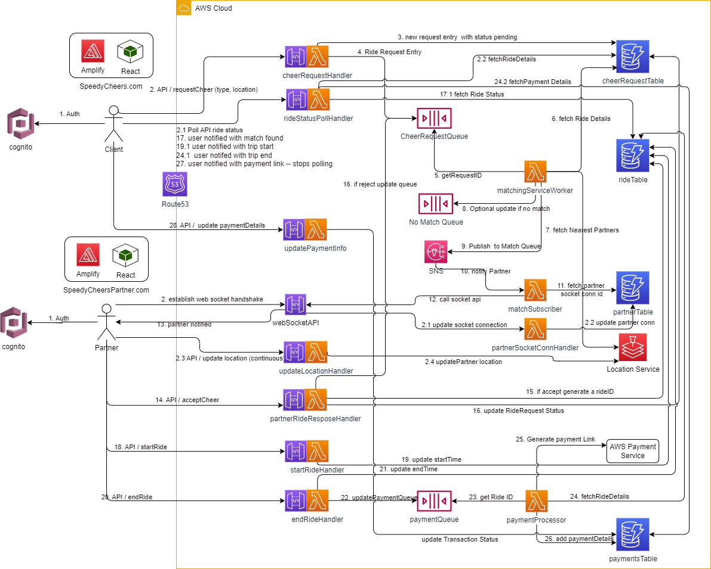

## Functional Requirements

- Request Submission: Users must have the capability to submit a "Request a Cheer" through the application, detailing their current location and possibly the type of cheer they need.

- Driver Notification: The nearest SpeedyCheer driver to the user’s location must be automatically notified of the new cheer request, including the location and details of the request.

- Accepting Requests: Drivers should be able to accept cheer requests through their version of the application. Upon acceptance, the user is notified that a driver is on their way.

- Session Timing and Billing: The application must track the duration of each cheer session, starting from the driver's arrival to the completion of the task. Users are billed in 5-minute increments at a rate of $10 per 5 minutes.

- Location Services: Real-time location tracking for drivers to efficiently match them with nearby user requests. 

- Optional - Online Payment Services

## Architeture Diagram

## SpeedyCheers Schema

| Table Name        | Attribute Name    | Data Type | Key Type | Indexes                    | Description                                                                                   |
|-------------------|-------------------|-----------|----------|----------------------------|-----------------------------------------------------------------------------------------------|
| User Table        | UserID            | String    | Primary  |                            | Unique identifier for the user.                                                              |
|                   | Username          | String    |          |                            | User's chosen name.                                                                           |
|                   | Email             | String    |          | EmailIndex                 | User's email address.                                                                         |
|                   | PasswordHash      | String    |          |                            | Hashed password for authentication.                                                           |
|                   | Location          | Map       |          |                            | Last known location with latitude (Number) and longitude (Number).                            |
|                   | CreatedAt         | Number    |          |                            | Timestamp of user registration (UNIX timestamp).                                              |
|                   |                   |           |          |                            |                                                                                               |
| Driver Table      | DriverID          | String    | Primary  |                            | Unique identifier for the driver.                                                            |
|                   | Name              | String    |          |                            | Driver's name.                                                                                |
|                   | Email             | String    |          |                            | Driver's email address.                                                                       |
|                   | PasswordHash      | String    |          |                            | Hashed password for authentication.                                                           |
|                   | CurrentLocation   | Map       |          |                            | Driver’s current location with latitude (Number) and longitude (Number).                      |
|                   | Status            | String    |          | StatusIndex                | Indicates if the driver is available, busy, etc.                                              |
|                   | CreatedAt         | Number    |          |                            | Timestamp of driver registration.                                                             |
|                   |                   |           |          |                            |                                                                                               |
| CheerRequest Table| RequestID         | String    | Primary  |                            | Unique identifier for the cheer request.                                                      |
|                   | UserID            | String    |          | UserIDIndex                | Identifier for the user making the request.                                                    |
|                   | RequestLocation   | Map       |          |                            | Location of the cheer request with latitude (Number) and longitude (Number).                  |
|                   | RequestType       | String    |          |                            | Type of cheer requested.                                                                      |
|                   | Status            | String    |          | StatusIndex                | Current status of the request (e.g., pending, matched).                                        |
|                   | CreatedAt         | Number    |          |                            | Timestamp when the request was made.                                                          |
|                   | RideID            | String    |          |                            | Identifier for the ride/session once matched.                                                 |
|                   |                   |           |          |                            |                                                                                               |
| Ride (Session) Table | RideID          | String    | Primary  |                            | Unique identifier for the ride/session.                                                       |
|                   | RequestID         | String    |          | RequestIDIndex             | Linked cheer request identifier.                                                              |
|                   | DriverID          | String    |          | DriverIDIndex              | Identifier for the driver who accepted the request.                                            |
|                   | StartLocation     | Map       |          |                            | Starting location of the session with latitude (Number) and longitude (Number).                |
|                   | EndLocation       | Map       | Optional |                            | Ending location, if applicable.                                                               |
|                   | StartTime         | Number    |          |                            | Timestamp when the session started.                                                           |
|                   | EndTime           | Number    | Optional |                            | Timestamp when the session ended.                                                             |
|                   | Status            | String    |          |                            | Status of the ride (e.g., active, completed).                                                  |
|                   | Fare              | Number    |          |                            | Calculated fare for the session.                                                              |
|                   |                   |           |          |                            |                                                                                               |
| Payment Table     | PaymentID         | String    | Primary  |                            | Unique identifier for the payment transaction.                                                 |
|                   | RideID            | String    |          | RideIDIndex                | Linked ride/session identifier.                                                               |
|                   | UserID            | String    |          | UserIDIndex                | Identifier for the user who made the payment.                                                  |
|                   | Amount            | Number    |          |                            | Amount charged for the session.                                                               |
|                   | PaymentMethod     | String    |          |                            | Details of the payment method used.                                                            |
|                   | Status            | String    |          |                            | Status of the payment (e.g., processed, failed).                                               |
|                   | ProcessedAt       | Number    |          |                            | Timestamp when the payment was processed.                                                      |

